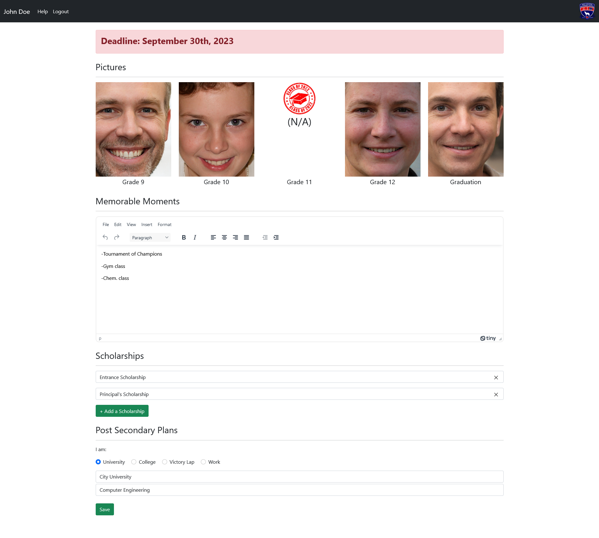
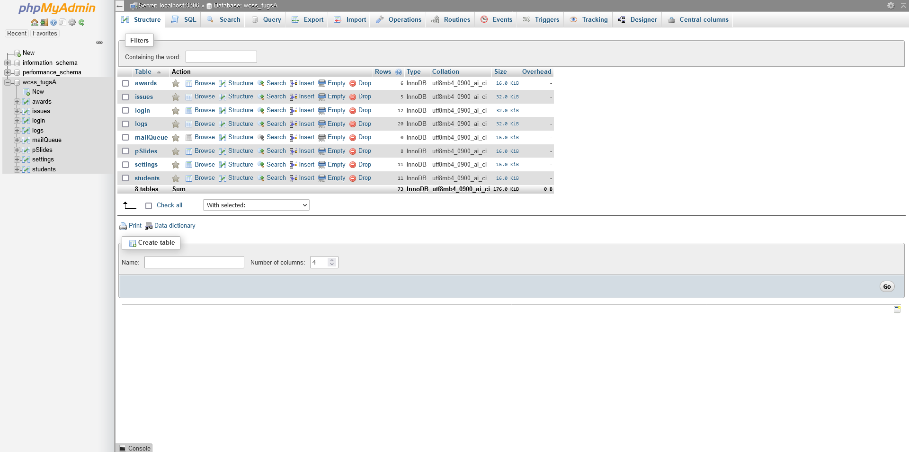

# TUGS Project

This is the TUGS (The Ultimate Graduation Slideshow) Project, which was completed for my Grade 12 Computer Science (ICS4U) class.

## Purpose

The goal tasked to my group of 5 was to create a web application to act as a graduation slideshow system for our highschool. The student side would allow students to edit and review their slide. The admin side would allow admins to overwrite student slides, review student notifications, edit the student list, create announcements, add/edit non-student slides, etc.

The graduation slideshow would then be played at the graduation ceremony.

## Skills

- PHP
  - to create dynamic webpages
- JavaScript
  - for AJAX requests, increased webpage functionality
- HTML/CSS
  - for basic page structure/style
- SQL (MySQL)
  - to access and store the app's data

## Pictures & Video

### Website

announcements.php

---

archivedYears.php

---

editSlides.php

---

editStudInfo.php

---

login.php

---

notification.php

---

notifications.php

---

slideOrder.php

---

slideSettings.php

---

startSlideshow.php

---

student.php

---

studentList.php

---

studentSlide.php

---

uploadPhotos.php

---

uploadPhotos.php (2)
.png> "uploadPhotos.php (2)")

### Slideshow

https://user-images.githubusercontent.com/79420331/188745431-24e84f9e-d523-4aeb-be98-cddbcff18b27.mp4

### Database

wcss_tugsA

---

awards

---

issues

---

login

---

logs

---

pSlides

---

settings

---

students

